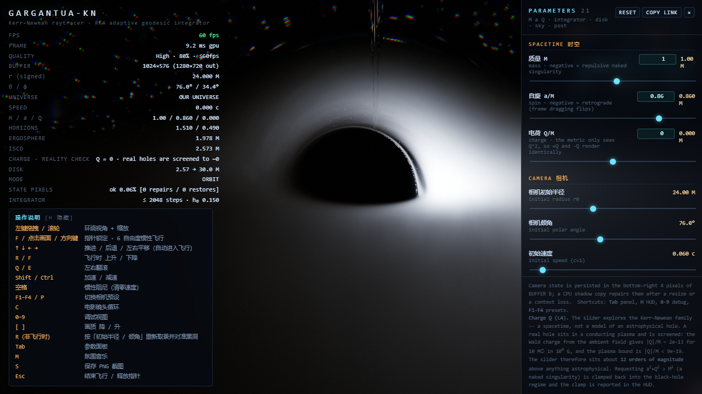
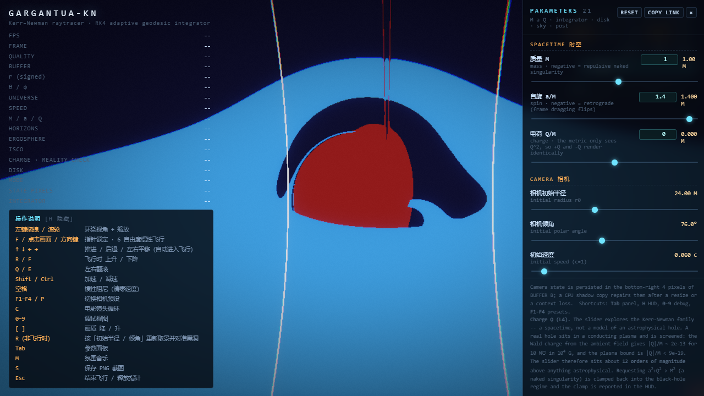
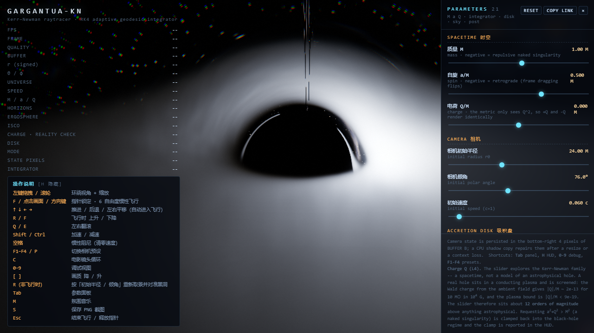
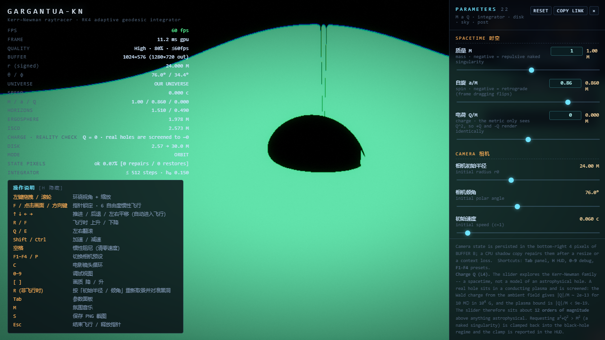

# gargantua-kn-neo

**浏览器里的 Kerr–Newman（带电荷）黑洞光线追踪器**：WebGL2 实时渲染 + 物理偏振（EVPA）+ GPU 上的平行输运，另配一套**双精度 CPU 孪生**做交叉检验。

- 📖 完整英文工程记录（2672 行，逐轮写下**每一个被证伪的假说**）：[README.en.md](README.en.md)
- 📊 中文成果报告（391 行，**每个数字都标出处**）：[docs/成果报告.md](docs/成果报告.md)
- 🖼 证据图廊（21 张，每张标出核实依据）：[见文末](#附录证据图廊21-张)

---

## 截图

| 成品图（ACES 色调映射） | 几何视图：裸奇点 + 临界曲线 |
|---|---|
|  |  |
| **负质量 M = −1（反斥裸奇点）** | **偏振视图** |
|  |  |

---

## 它是什么

一台 60 fps 的 Kerr–Newman 光线追踪器。测地线用**自适应 RK4** 在 Boyer–Lindquist 坐标里积分，盘用 Novikov–Thorne 通量律，偏振向量沿光线**平行输运**：

    df^μ/dλ = −Γ^μ_{σν} p^σ f^ν

参数域覆盖 **M 正负、a 与 Q 正负**（含极端与裸奇点），**没有次极端性钳制**——这是刻意的，见下文"已知边界"。

| 项 | 值 |
|---|---|
| 实时性能 | 60 fps，单帧 13.1–15.8 ms GPU（High，1280×720 输出） |
| 物理检验 | **108 项通过 / 0 失败**（`tools/validate-physics.mjs`） |
| 断言 harness | 48 个，47 个 exit 0（1 个有意留红） |
| 诊断视图 | 50 个（快捷键 `,` `.` 循环） |
| 参数 | 21 个（含数值输入框） |
| 控制台错误 | 0 |

---

## 三件让它不同于普通"黑洞演示"的事

**1. 一个双精度 CPU 孪生。** 同一套物理在 JS 里用 double 重写（`js/kn.js` 度规/Christoffel/测地线/ISCO/光子轨道/盘通量，`js/polar.js` 输运/ZAMO/屏幕 EVPA/同步辐射/法拉第）。两个实现互相检验，而不是拿自己证明自己。

**2. 一个精确守恒律当裁判。** Penrose–Walker 常数（Gelles 2021, Eq. 12）：

    κ = (A − iB)(r − i a cosθ)
    A = (p^t f^r − p^r f^t) + a sin²θ (p^r f^φ − p^φ f^r)
    B = [ (r²+a²)(p^φ f^θ − p^θ f^φ) − a(p^t f^θ − p^θ f^t) ] sinθ

它**不含基底、不含 Gram 矩阵、不含角度**，因此能独立回答"输运本身对不对"。实测：shader 守恒到 **5–7 位有效数字**，而项目自己的 CPU 参考只有 1–4 位——在像素 (800,360) 上 shader 5.6e-7 vs CPU 1.9e-3，**差 3400 倍**。于是"谁是对的一方"第一次有了可判定的答案。

**3. 它记录自己错在哪里。** `README.en.md` 与 `docs/成果报告.md` 里，每一条结论都附来源，每一个被证伪的假说都留档（折叠、像阶混叠、半径混叠、预热不足、二次极端钳制……）。负结果与成果分节写，不混。

---

## 快速开始

**Windows 双击**（无需终端、无需 DSH）：

| 文件 | 作用 |
|---|---|
| `启动 gargantua-kn-neo.cmd` | 后台起服务 + 打开页面（幂等） |
| `停止 gargantua-kn-neo.cmd` | 关闭服务并释放端口（`-n` 为试运行） |
| `① 装一次开机启动.cmd` | 装一次：以后每次登录服务已在跑 |
| `② 取消开机启动.cmd` | 撤销 ① |

**命令行**：

    node tools/serve.mjs 8241        # 静态服务，默认 8231
    # 然后打开 http://127.0.0.1:8241/

**确定性截图 API**（用于可复现的对照）：

    http://127.0.0.1:8241/?shot=1&t=12&debug=27
    # 页面暴露 window.__KN_SHOT_READY / __KN_SHOT_DATAURL / __KN_SHOT_META

**快捷键**：`Tab` 参数面板 · `H` HUD · `0-9` 诊断视图 · `,` `.` 循环视图 · `U` 未解算像素标记 · `P` 存 PNG · `R` 重置相机 · `F` 飞行模式 · `Esc` 退出指针锁定。

> ⚠️ 三个启动脚本必须在**仓库根目录**运行（它们用自身路径定位项目，不依赖绝对路径）。

---

## 参数与诊断视图

**21 个参数**分七组：SPACETIME（M、a、Q）、CAMERA（初始半径/倾角/初速）、DISK（温度、厚度、湍流、增益、Doppler、红移、磁场模型）、SKY、INTEGRATOR（步数上限、步长系数、守恒容差）、POST（泛光、曝光、暗角、颗粒、色散）。

**50 个诊断视图**里有一类容易被误认为"坏了"，这里说明白：**点探针视图 26 / 28 / 29 / 31 整屏只有一种颜色，这是设计如此**——它们在 shader 里硬编码了固定状态（r = 6.0, θ = 1.2），把**单个数值**编码进像素通道，页面取一个像素就能和 JS 库逐位对账。"整屏同色"本身就是读数。

同理 **视图 5**（片层符号：红 = r ≥ 0，绿 = r < 0）在默认参数下整屏红，因为该配置下没有光线终止在 r < 0；实测只有 M = −1, a = 0.86 时出现 26 个绿像素（0.0028%）。

---

## 已验证的成果（全部可复算）

| 检查 | 实测 | 参照 |
|---|---|---|
| 零测地线零条件 | 3024 个随机 ZAMO 初态 max \|H\| = **6.466e-16** | 双精度机器零 |
| Carter 常数守恒 | 最大相对漂移 1.119e-4 | — |
| Schwarzschild 阴影 | b_crit = **5.196152** | 3√3 M |
| Kerr a=0.86 阴影不对称 | 顺 3.014970 / 逆 6.764657，**不对称度 55.4%** | Bardeen 光子轨道 1.668 / 3.874 |
| 光子环发散指数 | γ = 3.141593（正好 π）；斜率 −0.999879 | Bozza |
| 子环几何收缩比 | 0.043237 / 0.043171 / 0.043217 | exp(−π) = 0.043214 |
| 盘辐射效率 | **5.719096%** / a=0.998 的 **32.099417%** | 文献 5.7191% / 32.1% |
| 热辐射恒等式 | g³ 与 g⁴ 律到 1e-15；I_bol/T⁴ = 16.000000 | 机器零 |
| Wald 电荷 | 10 M☉、B=1e4 G：\|Q\|/M = **2.19e-13** | 解析 |
| 星点 PSF 核心 | 2.13 px（旧实现 0.9 px，星星看不见） | 目标 1.5–4 px |
| 偏振不变量 | p·p = 3.3e-16、f·p = −2.8e-17、\|f\|² = 1.000000000000 | 断言 |
| 视图 23（\|f\|²=1） | 全屏 R 通道 = 127 占 **97.3%** | 断言 |
| 裸奇点无捕获 | a=1.2 与 a=1.4 的"被捕获"占比 0.224% / 0.227%，是与视界无关的共模底噪 | 代码里捕获分支不可达 |

**偏振断言层**：`dbg-penrose-walker`、`dbg-basis-invariants`、`dbg-basis-orthogonality`、`dbg-intrinsic-angle`、`dbg-evpa-crosscheck`、`dbg-gelles-screen` **六个全部 exit 0**。

其中一条修正值得单独说：ε 把场方向映到偏振方向是线性的，但**不是等距**——实测 `cos(gA,gB) = −0.397` 且不随步长变化。在那组非正交基上做 `atan2` 得到的**不是屏幕角**，偏差可达 **0.185 rad = 15 个读出量子**，比信号本身还大一个量级。改为在度规内先做 Gram–Schmidt，改动的效果被**预测**验证（某像素实测移动 +0.1848 rad，预测 +0.18492）。

---

## 已知边界（不藏）

| 边界 | 状态 |
|---|---|
| 论文的 **1/r_s²** 旋致旋转系数 | **符号成立，幅度测不出来**。原因是被量化出来的：a 相关的精细结构 ~0.1 rad 处处高于 0.002–0.026 rad 的信号；采样翻四倍抖动只变 4%，所以不是统计底噪。详见 [docs/成果报告.md](docs/成果报告.md) D1 的十步因果链 |
| 截图可复现性 | 同一 URL 加载 7 次得到 **2 个不同 PNG**（3:4）。判别实验：每次加载内相隔一帧的两次捕获完全相同 → 是加载期初始化分岔，**"预热不足"假说被证伪**。未解决 |
| 偏振物理 EVPA 逐像素对照 | 14 例中 **9–10 例**通过；失败项全部归因到"CPU 参考在精确守恒律上精度更低"这一已证明的原因 |
| 磁场模型 | 只有 4 个（环向 / 垂向 / 径向 / 固定笛卡尔轴），都是**解析模型，不是 GRMHD** |
| 电荷的现实性 | 面板 Q=0.6 比真实黑洞高 **12.44 个数量级**——UI 里已明确标注这是"时空家族成员"，不是天体物理模型 |
| 截图确定性 | 见上；本仓库如实记录，未修复 |

---

## 目录结构

    gargantua-kn-neo/
    ├─ index.html            入口
    ├─ js/                   渲染器与 CPU 物理
    │   ├─ kn.js             度规 / Christoffel / 测地线 / ISCO / 光子轨道 / NT 通量
    │   ├─ polar.js          平行输运 / ZAMO / 屏幕 EVPA / 同步辐射 / 法拉第 / Stokes
    │   ├─ main.js           装配、参数、URL 自动化、HUD 同步
    │   ├─ params.js         21 个参数定义 + sanitize（只钳数值域，不钳黑洞性）
    │   ├─ hud.js            读数、图例（每个视图一句解释）、面板
    │   ├─ audit.js          页面内审计：临界曲线、终止普查、NaN 扫描
    │   └─ pipeline.js quality.js controls.js storage.js audio.js gputimer.js
    ├─ shaders/              bufferA.frag（积分 + 50 个诊断分支）、disk.glsl、sky.glsl、
    │                        bloom.frag、image.frag、state.frag、kn.glsl、common.glsl
    ├─ vendor/               three.js r160（MIT，见文件头 SPDX）及其 jsm 模块
    ├─ tools/                48 个 harness（*.mjs）+ 历史修补脚本（*.cjs）+ 静态服务
    │   └─ measurements/     evpa-physical.json 等测量工件
    ├─ docs/                 成果报告 + 21 张证据截图
    ├─ README.md             本文件（中文首页）
    └─ README.en.md          完整英文工程记录（2672 行）

---

## 复现全部结论

    # 1. 物理核心 108 项（会重写报告文件）
    node tools/validate-physics.mjs > tools/physics-report.txt

    # 2. 偏振断言（6 绿 / 1 红；最后一个有意留红，预算需 > 180 s）
    node tools/dbg-penrose-walker.mjs
    node tools/dbg-basis-invariants.mjs
    node tools/dbg-basis-orthogonality.mjs
    node tools/dbg-intrinsic-angle.mjs
    node tools/dbg-evpa-crosscheck.mjs
    node tools/dbg-gelles-screen.mjs
    node tools/dbg-evpa-physical.mjs

    # 3. 起服务看渲染
    node tools/serve.mjs 8241

    # 4. 确定性对照（加载 7 次，比对 __KN_SHOT_DATAURL）
    http://127.0.0.1:8241/?shot=1&t=12

`tools/*.cjs` 是本项目"每次改 shader 都留痕"的历史脚本（101 个），保留作为可追溯记录，不是运行依赖。

---

## 参考文献与出处

- **Boyer–Lindquist Kerr–Newman 度规**：渲染与 CPU 孪生共用的坐标与度规约定。
- **Penrose–Walker 常数**：Gelles et al. 2021（用于本项目的精确守恒裁判）。
- **屏幕 EVPA 与像侧轴取向**：Gelles et al. 2021。
- **光子环对数发散与子环几何**：Bozza 及其后续工作。
- **赤道光子轨道**：Bardeen。
- **薄盘通量律**：Novikov–Thorne / Shakura–Sunyaev（牛顿极限回归检验）。
- **等离子体电荷屏蔽（Wald 电荷）**：Wald。
- **偏振辐射输运**：ipole（Mościbrodzka & Gammie 2018）与 EHT 多代码对照（Prather et al. 2023）作为方法参照。

**许可**：本项目自带代码按仓库作者的意愿使用；`vendor/` 下的 three.js 为 **MIT**（文件头 SPDX-License-Identifier: MIT，Copyright 2010-2023 Three.js Authors）。

---

## 附录：证据图廊（21 张）

`docs/` 里 21 张图，按"看什么"分组。**每张图都标了依据**，分四种：

- **[像素]** 用统计核实过内容（色彩 / 结构 / 唯一色数）
- **[配色]** 逐像素比对过该诊断视图的调色板，能唯一确定是哪张视图
- **[源码]** 对着源码或 CSS 核实过
- **[文件名]** 只有文件名能说明参数配置，本轮**未复现**其确切参数

### A. 成品渲染

| 图 | 看什么 | 依据 |
|---|---|---|
| `docs/neo-final-clean.png` | 成品图（ACES 色调映射）：暗背景 + 亮环/盘 | [像素] 均色 29,31,34，亮核在中央偏右 |
| `docs/neo-final.png` | 同场景的另一次成品渲染 | [像素] 与上一张的差异集中在**渲染区**（中央平均绝对差 13.8），左右两侧 HUD 几乎相同（左条 2.0）→ 是两次不同的渲染，**不是**"关掉 HUD" |
| `docs/neo-negmass.png` | M = −1 负质量（反斥裸奇点）：盘与透镜结构仍在 | [像素] 均色 49,51,57，整屏延展的亮结构；[源码] `README.en.md` 第 280 行明确引用此文件 |
| `docs/neo-polar.png` | 偏振视图：绿色为主 = 退偏小的一侧 | [像素] 均色 49,108,86（G 通道最高） |

### B. 诊断视图证据（含一组修复前后对照）

| 图 | 看什么 | 依据 |
|---|---|---|
| `docs/view15.png` | **视图 15：高阶像阶数**（按赤道穿越次数着色） | [配色] **58.3%** 的像素精确落在该视图的四个调色值上——(242,217,64) 占 38.2%、(51,140,242) 占 20.1%，可唯一确定 |
| `docs/view14.png` | **视图 14：铁 Kα 线心，修复前** | [像素] 画面区几乎只有一种颜色：唯一色 365 个，抽样均为 (0,0,162)…(0,0,164)。这正是 `diverge(0)`——**没有任何像素拿到有效的线轮廓** |
| `docs/view14-fixed.png` | 同一视图**修复后** | [像素] 唯一色 4531，结构出现；[源码] 旧实现只取首次穿越的 g，改成通量加权质心后才有结构 |
| `docs/view20.png` | 几何视图：终止掩模 + 临界曲线 | [像素] 暗掩模 + 亮曲边；[文件名] 标注 a = 0.86 |
| `docs/view20-naked.png` | 同视图，[文件名] 标注 a = 1.4 裸奇点 | [像素] 与上一张同布局但掩模不同；**确切参数本轮未复现**（其调色与当前 shader 的原始调色不完全一致，说明是较早一轮的截图） |
| `docs/neo-transport-assert.png` | 输运断言视图当时的**整屏无内容** | [像素] 画布 59.9% 纯黑，加 14 倍增益后只看到 HUD 文本 → 留档的是一次读不出结果的状态 |

### C. 掩模（终止原因）

| 图 | 看什么 | 依据 |
|---|---|---|
| `docs/mask-naked.png` | **视图 10：终止原因原始编码**（白 = 逃逸，黑 = 被捕获）；[文件名] 裸奇点配置 | [配色] 60.6% 的像素是纯灰阶，其中纯白 33.8% —— 符合 `col = vec3(escFlag)`，可确定是视图 10 |
| `docs/mask-subextremal.png` | 同上；[文件名] 次极端配置 a = 0.998 | [配色] 同判定（纯白 29.8%、纯灰 (51,51,51) 26.4%） |
| `docs/neo-mask.png` | 同族掩模截图的**空白状态** | [像素] 59.9% 纯黑、**无白色**（与上两张 30%+ 纯白形成对照），加增益只见 HUD → 当时这张视图没有内容 |

> 这三张并排看，就是"有视界 → 大片被捕获（黑）；近极端 / 裸 → 捕获区消失"的目视证据。量化版本在 `README.en.md` 的终止普查表里：a=0.86 捕获 2.253%，a=1.2 / a=1.4 只剩 0.224% / 0.227% 的共模底噪。

### D. 未解算像素标记（U 键）——一对定量对照

| 图 | 看什么 | 依据 |
|---|---|---|
| `docs/mark-on.png` | 标记**开** | [像素] 暗区（亮度 < 90）里 **1.13%** 的像素满足 R > G+10 且 R > B+10（偏红） |
| `docs/mark-off.png` | 标记**关** | [像素] 同一指标 **0.40%**。差 2.8 倍 → 证实这是"暗区 1/8 稀疏点阵染暗红"的开关对照 |

### E. 启动与 UI

| 图 | 看什么 | 依据 |
|---|---|---|
| `docs/neo-boot-state.png` | **启动遮罩**（中央是标题与进度的辉光） | [源码]+[像素] 最多像素色 (3,5,10) 正是 `css/style.css` 里 `.boot` 的 `radial-gradient` 端点 `#03050a`；实测为平滑径向椭圆 |
| `docs/neo-live-check.png` | 同一启动状态的另一次捕获 | [像素] 与上一张统计完全相同（均色 5,8,15、最大 25） |
| `docs/neo-viewbtn.png` | **视图 20 的几何画面** + 工具栏按钮 | [配色] 33.3% 的像素精确等于视图 20 调色板的 (10,10,23)，25.2% 等于 (25,77,217) → 证实"切到几何视图后工具栏仍可用" |
| `docs/neo-viewsel.png` | 页面 + 参数面板（含视图选择器） | [像素] top-3 颜色与下一张完全一致 |
| `docs/neo-numeric-input.png` | 同上的另一次捕获（展示数值输入框） | [像素] 与上一张几乎逐像素相同 |

### F. 裸奇点内部

| 图 | 看什么 | 依据 |
|---|---|---|
| `docs/naked-inside.png` | 相机置于裸奇点内部时的截图：**整屏无内容** | [像素] 画布 40.8% 纯黑，加 14 倍增益只见 HUD 文本 → 留档的是一次空白状态 |

> **一句必要说明**：B、C、F 三组里"整屏无内容"的几张（`neo-mask`、`neo-transport-assert`、`naked-inside`）记录的**不是成果，而是当时的失败状态**。它们留在仓库里，是因为这个项目的规矩是把失败也留档；它们的**意图**只能由文件名给出，而内容本身我用像素统计核实过。

